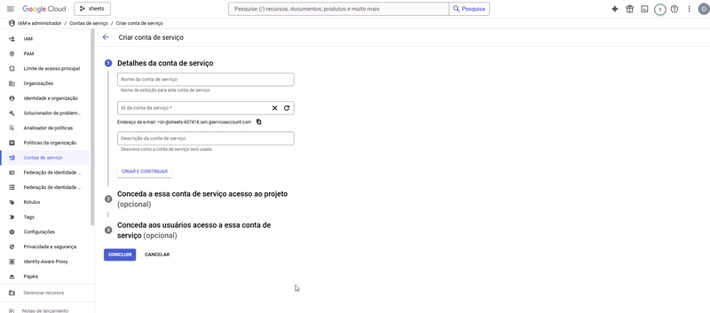

# electron-app

An Electron application with React and TypeScript

## Recommended IDE Setup

- [VSCode](https://code.visualstudio.com/) + [ESLint](https://marketplace.visualstudio.com/items?itemName=dbaeumer.vscode-eslint) + [Prettier](https://marketplace.visualstudio.com/items?itemName=esbenp.prettier-vscode)

## Project Setup

### Install

```bash
$ npm install
```

### Development

```bash
$ npm run dev
```

### Build

```bash
# For windows
$ npm run build:win

# For macOS
$ npm run build:mac

# For Linux
$ npm run build:linux
```

## How to Get Credentials Keys

### Step 1: Access Google Cloud Console
  Visit [Google Cloud Console](https://console.cloud.google.com/).


### Step 2: Navigate to APIs & Services

1. Click on **APIs & Services** in the left-hand menu.

 

### Step 3: Create a Service Account

1. Go to **Credentials**
2. Click on **Manage service accounts**
3. Click **Create Service Account**

 


4. Enter a description, assing the **Owner** role, then **Continue** and **Done**

 

### Step 4: Generate Access Key

1. Locate the newly created service account.
2. Click **Actions** > **Manage keys**
3. Click **Add Key** > **Create new Key**
4. Select **JSON** and click **Create**

 

5. The JSON key file will be downloaded to your computer. Store it securely.

###

