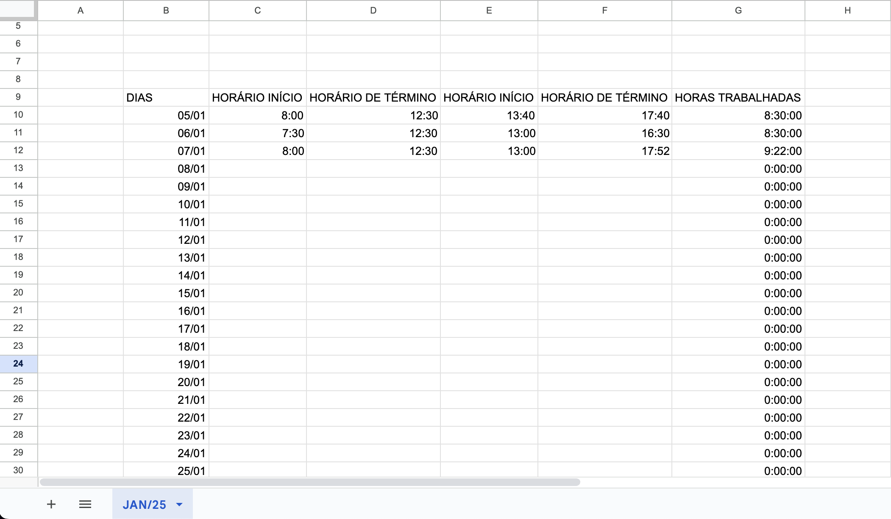

# WorkTime Automator

  <br/>

I developed an Electron application to streamline working with spreadsheets. This app simplifies the process of adding and managing values, making it more efficient and user-friendly. By automating repetitive tasks, it saves time and reduces errors, providing a seamless experience for handling spreadsheet data.

  <br/>

 

  <br/>

> [!IMPORTANT]
> The requirement to this app work is:   
> 1. The sheet must exist with the correct title in the month and year format (MMM/YY).
> 2. Days column format as DD/MM
> 3. The header must be exactly as demonstrated above:
>    - DIAS
>    - HORÁRIO INÍCIO
>    - HORÁRIO DE TÉRMINO
>    - HORAS TRABALHADAS

## Features

You can use commands to execute actions easily **"Inicio do expediente..."** menu (<kbd>Alt</kbd> + <kbd>Ctrl</kbd> + <kbd>E</kbd> + <kbd>N</kbd> / <kbd>Alt</kbd> + <kbd>Cmd</kbd> + <kbd>Ctrl</kbd> + <kbd>N</kbd>) to start the working time quickly.

 

### How to run
```bash
$ npm run dev
```

### Build

```bash
# For windows
$ npm run build:win

# For macOS
$ npm run build:mac

# For Linux
$ npm run build:linux
```

## How to Get Credentials Keys

### Step 1: Access Google Cloud Console
  Visit [Google Cloud Console](https://console.cloud.google.com/).

### Step 2: Navigate to APIs & Services
  1. Click on **APIs & Services** in the left-hand menu.
  
  <br/>

 

### Step 3: Create a Service Account

  1. Go to **Credentials**
  2. Click on **Manage service accounts**
  3. Click **Create Service Account**

  <br/>

 

  <br/>

  4. Enter a description, assing the **Owner** role, then **Continue** and **Done**
    
  <br/>

 

### Step 4: Generate Access Key

  1. Locate the newly created service account.
  2. Click **Actions** > **Manage keys**
  3. Click **Add Key** > **Create new Key**
  4. Select **JSON** and click **Create**

  <br/>

 

  <br/>

  5. The JSON key file will be downloaded to your computer. Store it securely.
 
### Step 5: Add the credentials to APP

  1. Open the app
  2. Click on **Config**

  <br/>

 

  <br/>

  3. The client email and private key are located in the previously downloaded JSON file from Google. (Use the values without the quotation marks.)
  4. The ID is located in the Google Sheet URL after the d/ and before the next /.
  
  <br/>

 
  
  <br/>

  4. Click on **save**

  <br/>


  <br/>

  5. If all steps are completed successfully, the view will enable the action buttons and display the total working time for the current month.

> [!NOTE]
> Contact me or submit a bug, diken.dev@gmail.com
